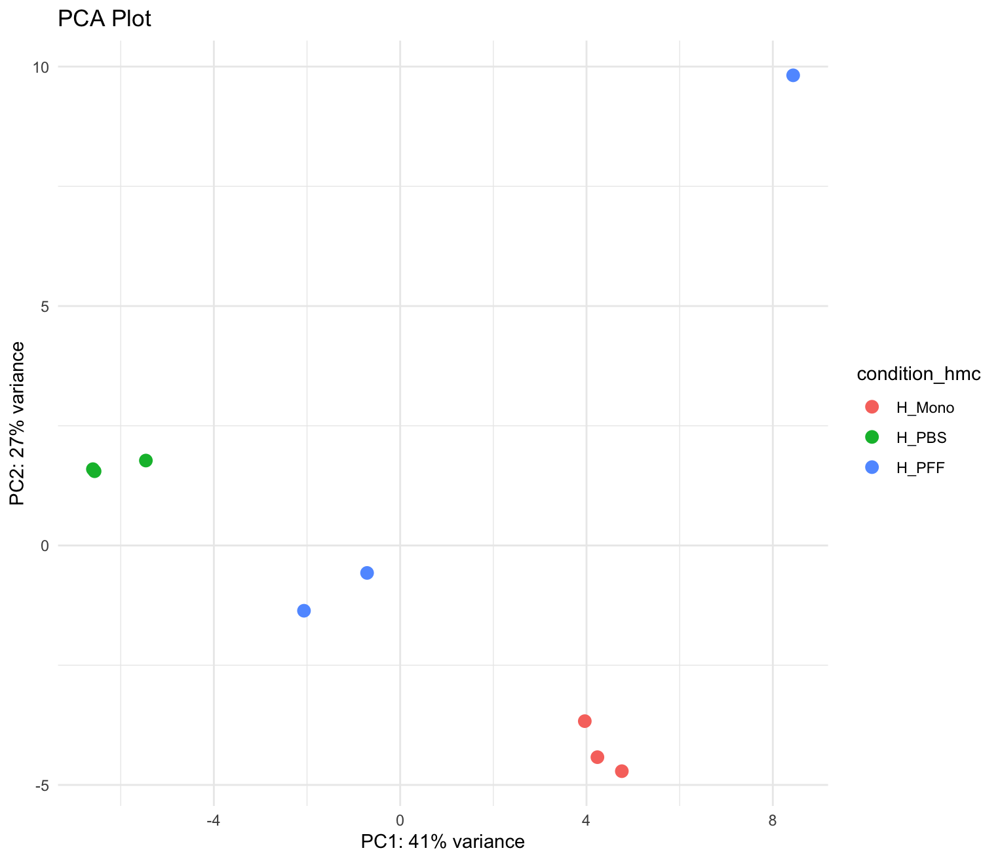
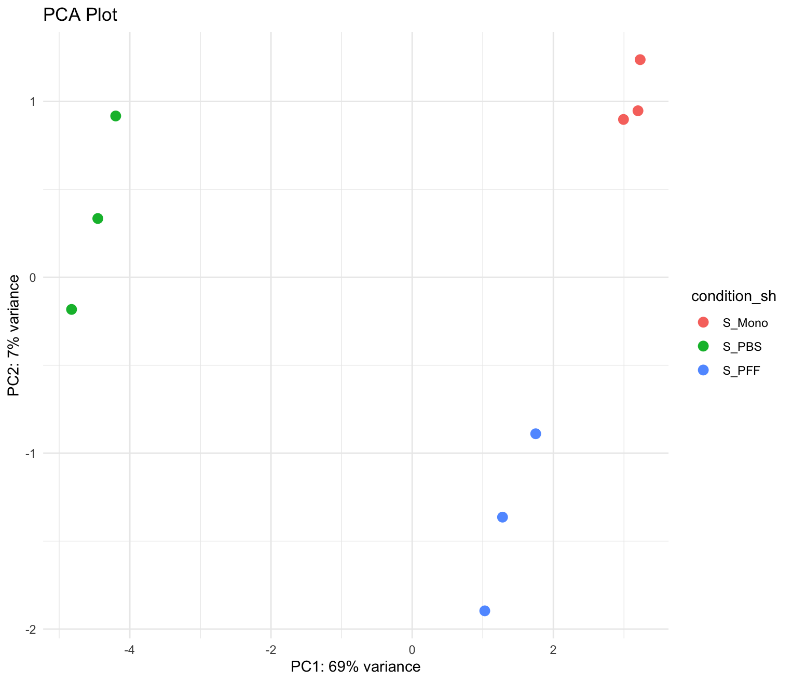
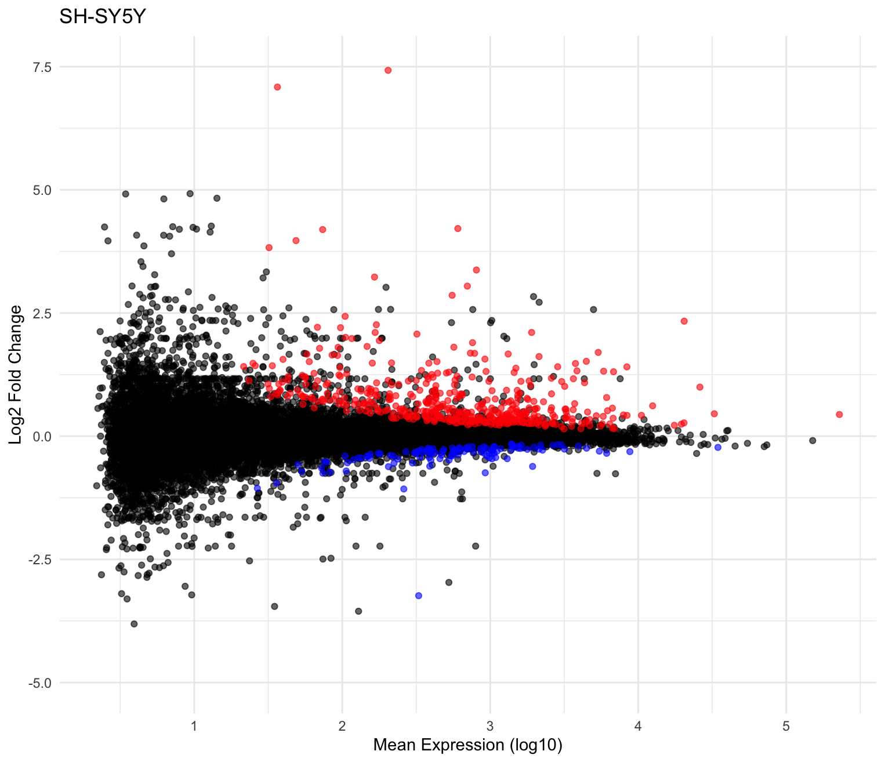
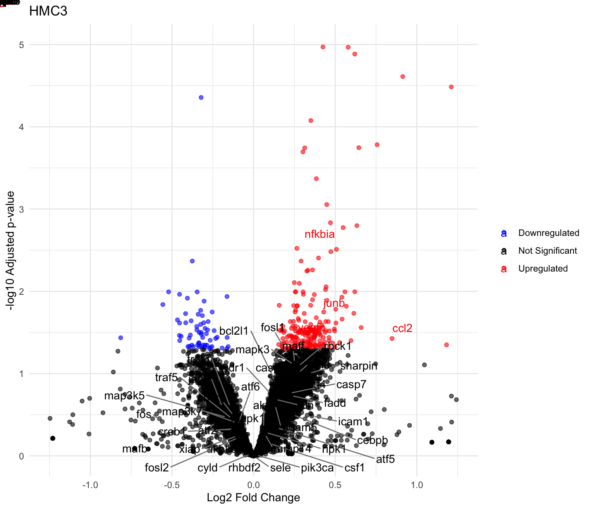
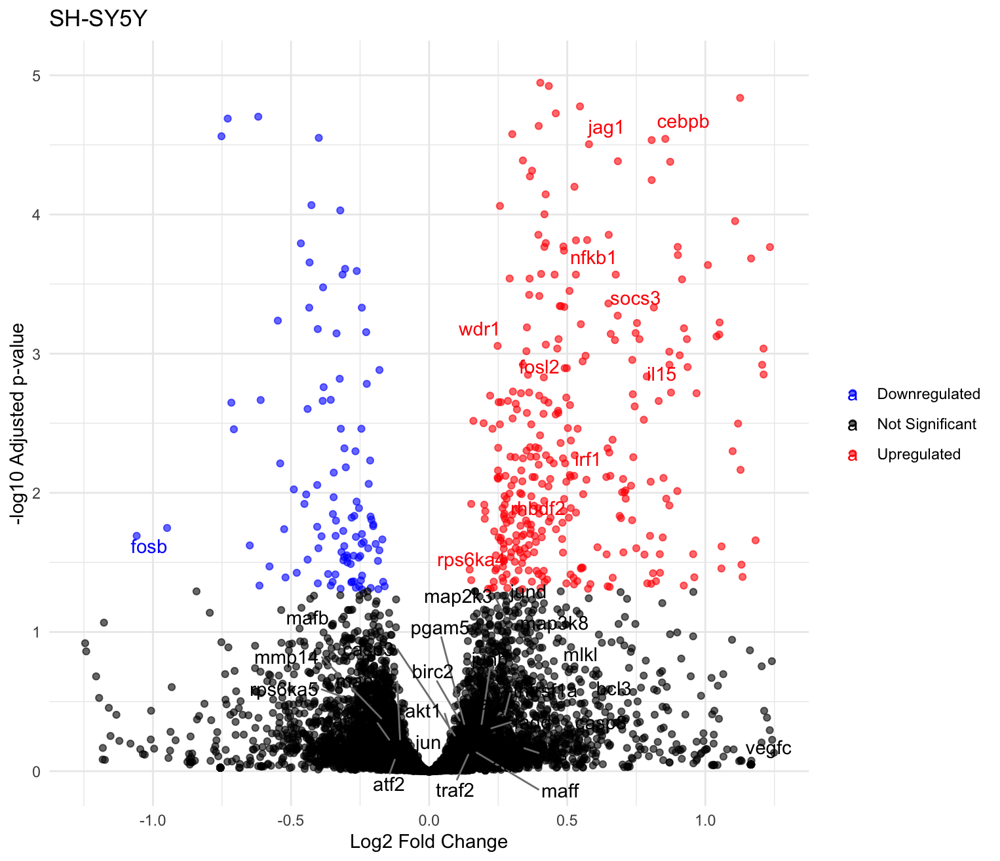
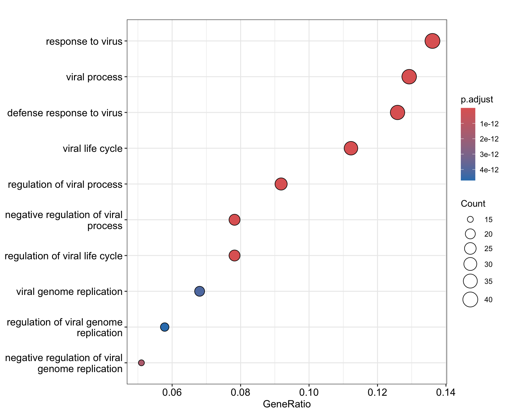
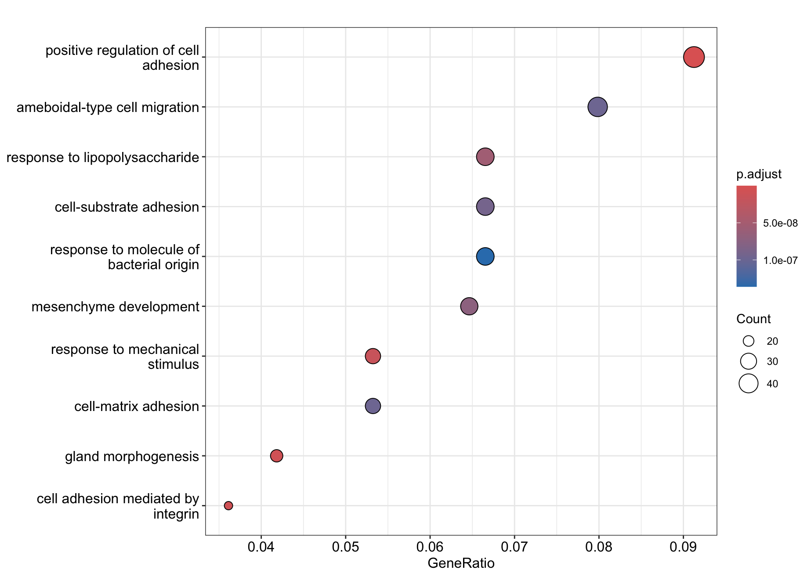

# R_CompBio
Transcriptomics projects developed in RStudio

# aSyn_RNA_Seq
Generated microglial (HMC3) and differentiated neuron (SH-SY5Y + retinoic acid) samples treated with PBS, aSyn monomer and aSyn pre-formed fibrils in triplicate for RNA-sequencing. The file aSyn_New_Analysis.r contains the RStudio script used to analyze the count matrix table (subread_counts_gene_symbol.txt). Below are some of the plots that were generated for quality control of the RNA-seq data and analysis of the PFF vs. PBS contrast in HMC3's and SH-SY5Y.

1. Principal component analysis (PCA) plot of all samples

2. PCA plot of HMC3 samples

3. PCA plot of SH-SY5Y samples

4. Mean-difference (MD) plot of PFF vs. PBS HMC3 contrast

5. Mean-difference (MD) plot of PFF vs. PBS SH-SY5Y contrast

6. Volcano plot of downregulated and upregulated genes in PFF vs. PBS HMC3 contrast

7. Volcano plot of downregulated and upregulated genes in PFF vs. PBS SH-SY5Y contrast

8. Top 10 Gene Ontology enriched terms in PFF vs. PBS HMC3 contrast

9. Top 10 Gene Ontology enriched terms in PFF vs. PBS SH-SY5Y contrast

