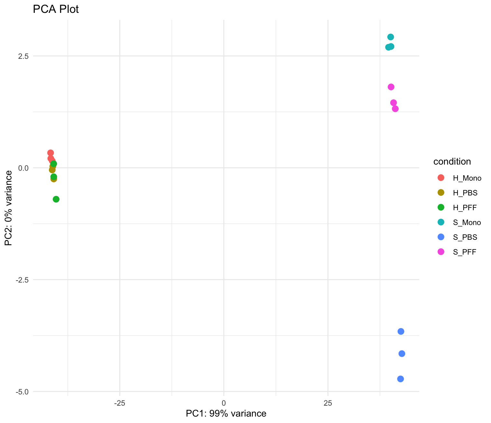
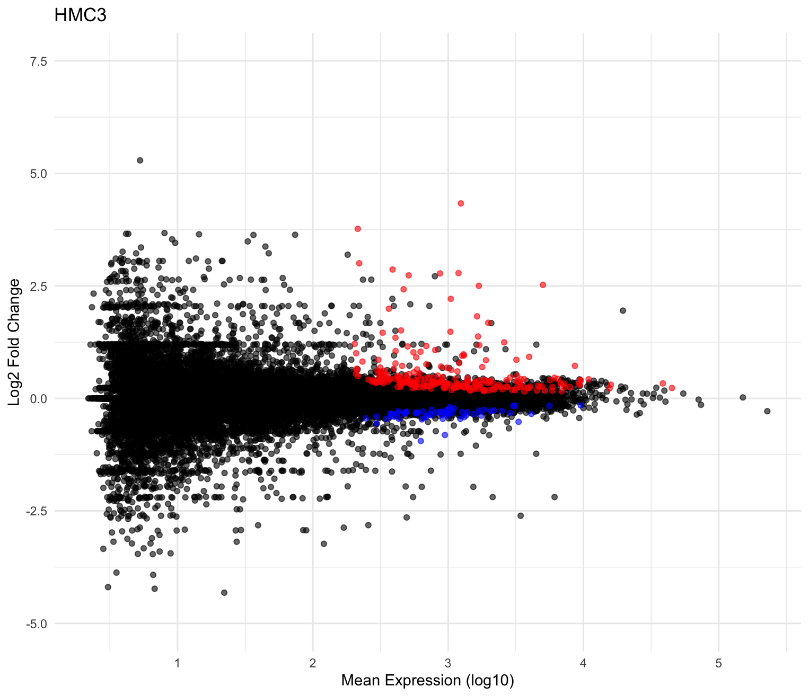

# R_CompBio
Transcriptomics projects developed in RStudio

# aSyn_RNA_Seq
Generated microglial (HMC3) and differentiated neuron (SH-SY5Y + retinoic acid) samples treated with PBS, aSyn monomer and aSyn pre-formed fibrils in triplicate for RNA-sequencing. The file aSyn_New_Analysis.r contains the RStudio script used to analyze the count matrix table (subread_counts_gene_symbol.txt). Below are some of the plots that were generated for quality control of the RNA-seq data and analysis of the PFF vs. PBS contrast in HMC3's and SH-SY5Y.

